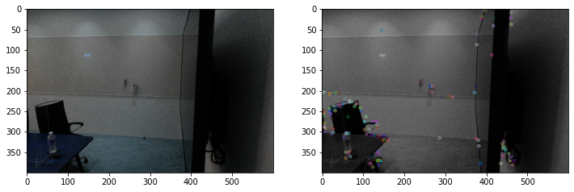
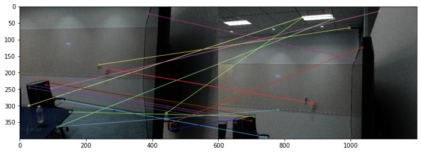
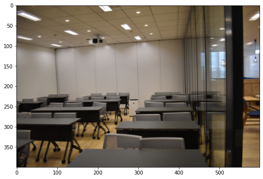
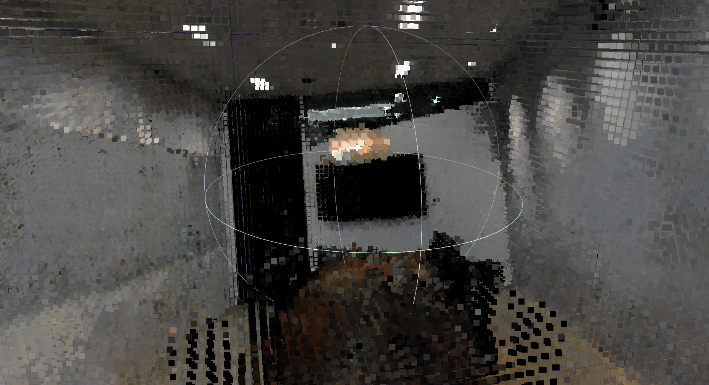

# COLMAPとNeRFを使った3次元復元
## Google Colab用ノートブック
- 学習済みモデルによるレンダリング [](http://colab.research.google.com/github/ALBERT-Inc/NeRF-tutorial/blob/main/notebook/03_render_nerf_colab.ipynb)

## 1: COLMAPの紹介と各種コマンド

COLMAPはSfM用のソフトウェアです。カメラパラメータの推定に加え、ソフトウェア単体でも3次元復元ができます。インストールは[githubのリリースページ](https://github.com/colmap/colmap/releases)からOSに合わせて実行ファイルをダウンロードできます。復元の一部過程にGPU(cuda)を利用する場合、ソースコードからのビルドが必要になるようです。

操作はGUIとCUIの両方に対応しており、GUIではソフトウェア上の各種ダイアログで細かな設定ができます。CUIでは、コマンドライン引数の形で推定に使うパラメータを設定できます。コマンドライン引数を利用する場合は `colmap <操作名> -h` で各操作における引数が確認できます。

### 1.1: COLMAPの前提
SfMは、2次元の画像から3次元の情報を復元するタスクです。しかし、画像は撮影された時点で2次元に落とし込まれているため、例えば奥行きのような情報が消えてしまいます。失われた情報を1枚の画像のみから復元することは不可能なため、少なくとも2枚以上の画像間で視差をとる必要が出てきます。このように、複数の画像を入力として、被写体の座標情報やカメラの撮影情報を推定するツールがCOLMAPになります。

### 1.2: プロジェクトの初期化
想定しているディレクトリ初期構成は以下の通りです。本リポジトリでは、&lt;project_dir&gt;は`NeRF-tutorial/dataset/<dataset名>`以下を想定しています。
```
<project_dir>
.
├── <sparse_dir>
└── <image_dir>
    ├── Image0.jpg
    ├── Image1.jpg
    ├── …
    └── ImageN.jpg
```
- GUI `File > New project`
DatabaseはNewを選択し、database.dbなど適切な名前を入力します。Imagesはselectを選択して&lt;image_dir&gt; を指定します。saveを押すとプロジェクトが作成できます。
- CUI
特になし。

### 1.3: 特徴点抽出
[SIFTアルゴリズム](http://labs.eecs.tottori-u.ac.jp/sd/Member/oyamada/OpenCV/html/py_tutorials/py_feature2d/py_sift_intro/py_sift_intro.html)を用いた画像内の特徴的な部分(特徴点)の抽出と、復元に利用するカメラモデル(カメラ内部パラメータの細かさ)を指定します。

SfMにおいて複数画像間の視差を取る際、画像中のピクセル全部を比較するのは効率が非常に悪いので、都合の良い点を画像中から見つけることを考えます。都合の良い点としては、画像を画像たらしめる特徴を持つ点であったり、他の画像と比較できる点が望ましいです。例えば、画像中の特徴点として、物体の角(コーナー)や模様のような情報が使えます。COLMAPの場合、特徴点抽出手法として画像のスケール変化(同じ点に注目しても、拡大されていた場合には特徴で無くなるような変化)に対して頑健なSIFTを用いています。SIFTアルゴリズムでは、画像内の二次元座標と、それに対応する近辺の局所特徴量(128次元)をセットで獲得します。以下の図はSIFTを利用して特徴点抽出をおこなった結果になります。



[カメラの内部パラメータ](https://jp.mathworks.com/help/vision/ug/camera-calibration.html)には、焦点距離f、画像中心cx/cy、半径方向の歪みパラメータk1、k2、k3、円周方向の歪みパラメータp1、p2、p3などがあります。
この内、カメラモデルによっては歪みパラメータであるkやpは省略されることもあります。
一般的なカメラパラメータモデルが持つ内部パラメータを以下の表にまとめています。

|  カメラモデル  |  パラメータ  |
| ---- | ---- |
| SIMPLE_PINHOLE | f, cx, cy |
| PINHOLE  | fx, fy, cx, cy |
| SIMPLE_RADIAL | f, cx, cy, k |
| RADIAL | f, cx, cy, k1, k2 |
| OPENCV | fx, fy, cx, cy, k1, k2, p1, p2 |
| FULL_OPENCV | fx, fy, cx, cy, k1, k2, p1, p2, k3, k4, k5, k6 |

その他カメラモデルがどのようなパラメータを返すかについては、[こちらのソースコード](https://github.com/colmap/colmap/blob/master/src/base/camera_models.h)のコメント部分に書かれています。
カメラのレンズ歪み補正にOpenCVを利用する都合で、以降ではOPENCVというカメラモデルを想定します。
なお、この時点のカメラの内部パラメータ推定では、画像プロパティのEXIF情報等から焦点距離のみが取得され、その他のパラメータは後段の処理で推定されることとなります。

- GUI `processing > Feature extraction`
- CUI
    - 引数
        - database_path: データベース(sqlite3)書き出しパス
        - image_path: &lt;image_dir&gt;までのパス
        - ImageReader.camera_model: [COLMAPで用いるカメラ内部パラメータモデル](https://colmap.github.io/cameras.html)
            - SIMPLE_PINHOLE: 焦点距離f、画像中心cx/cyのみピンホールカメラモデル
                - デフォルトモデル
            - SIMPLE_RADIAL: SIMPLE_PINHOLE + 半径方向の歪みパラメータk1、k2
            - OPENCV: SIMPLE_RADIAL + 円周方向の歪みパラメータp1、p2
                - 歪み補正をOPENCVで行う場合、このモデルを利用する
        - SiftExtration.gpu_index=0: SIFTの計算に使うGPU番号
            - GPUの使用はSiftExtraction.use_gpuで指定。使用は1(デフォルト)、不使用は0

```
$ colmap feature_extractor \
    --database_path=./database.db \
    --image_path=./<image_dir>/ \
    --ImageReader.camera_model=OPENCV \
    --SiftExtraction.gpu_index=0
```

### 1.4: 特徴点マッチング
画像間で特徴点の一致を取る処理になります。

画像集合中の各ペアについて、ペアごとの局所特徴量を最近傍探索することでマッチする点を見つけます。この結果、写っているものの重なり(マッチ)が確認された画像のペアと、そのペアにおける特徴点同士の対応関係が獲得できます。以下の図は、視点の異なる２枚の画像について特徴点マッチングをおこなった結果になります。




画像内に多数含まれる特徴点を全ての画像ペアについて比較すると計算量が膨大になるため、画像類似度で絞り込みを行うことで対応枚数を減らす等の工夫もあるようです[[参考](https://www.tugraz.at/fileadmin/user_upload/Institute/ICG/Documents/courses/robotvision/2019/RV_SFM.pdf)]。

- GUI `processing > Feature matching`
- CUI
    - 引数
        - database_path: 特徴点抽出で作成した.dbファイルへのパス
        - SiftMatching.gpu_index: 特徴量抽出と同じくマッチングで使うGPUの番号

```
$ colmap exhaustive_matcher \
    --database_path=./database.db \
    --SiftMatching.gpu_index=0
```


### 1.5: SfMの実行
特徴点マッチングで得られた画像ペアをもとに、条件を満たすような3次元点群を復元しながら、カメラの撮影位置(Translation)や回転(Rotation)を推定します。

COLMAPのSfMでは、Incremental SfMという手法を採用しています。これは、複数画像から一度にSfMを行うのではなく、2枚の画像ペアに対して[三角測量](https://daily-tech.hatenablog.com/entry/2019/07/15/183302)を行ってベースとなる点群座標の推定、カメラ位置/回転の推定をした後、徐々に画像を追加して辻褄を合わせていく処理になります。そのため、初めに選出される2枚の画像ペアが精度に大きな影響を与えるようです。画像を追加した後に、全体の最適化として[バンドル調整](https://daily-tech.hatenablog.com/entry/2021/05/03/180350)という作業を行います。バンドル調整では、Incremental SfMで推定した各カメラパラメータを利用して、改めて画像中の点を３次元空間上に再投影し、その損失の最も小さな組み合わせを探索します。

- GUI `reconstruction > Start reconstruction`
- CUI
    - 引数
        - database_path: 特徴点抽出で作成した.dbファイルへのパス
        - image_path: &lt;image_dir&gt;へのパス
        - output_path: &lt;sparse_dir&gt;へのパス

```
$ colmap mapper \
     --database_path=./database.db \
     --image_path=./<image_dir> \
     --output_path ./sparse
```

### 1.6: txtファイルへの書き出し
&lt;sparse_dir&gt;以下にバイナリで保存されている各種パラメータはそのままでは使いづらいため、txtファイルに書き出します。txtファイルの記述ルールについては、txtファイルのヘッダー部分に書き出されています。

- GUI `File > Export model as text`
- CUI
    - 引数
        - input_path: &lt;sparse_dir&gt;以下のバイナリを含むフォルダ。sparse直下の場合やsparse/0/のような下位ディレクトリがある場合があります。
        - output_path: txtファイルを保存する場所
        - output_type: 書き出す形式の指定

```
$ colmap model_converter \
        --input_path ./sparse/0/ \
        --output_path ./ \
        --output_type TXT
```

## 2: NeRFを使った復元
以降では、COLMAPで推定したカメラパラメータを利用して、NeRFモデルの学習と3次元復元を行います。
本実装を参考に紹介していきます。

### 2.1: COLMAP推定結果(txtファイル)の読み取り
COLMAP推定結果(txtファイル)には、`cameras.txt`、`images.txt`、`points3D.txt`の3ファイルが含まれます。それぞれのファイルには行単位で以下の内容が含まれています(詳細情報はtxtファイルのヘッダーに記述されています)。

- cameras.txt: 撮影に利用したカメラに関する、カメラモデルの情報
    - CAMERA_ID: COLMAP内のカメラID (全て同じカメラの場合は1種類のみ)
    - MODEL: 推定時に指定したカメラモデル
    - WIDTH: 画像の横サイズ
    - HEIGHT: 画像の縦サイズ
    - PARAMS[]: カメラモデルごとに指定されるパラメータ
- images.txt: SfMによって推定した画像ごとのカメラポーズ行列(2行ごとに記述)
    - IMAGE_ID: COLMAP内の画像ID
    - QW、QX、QY、QZ: クォータニオン表記のカメラ回転
    - TX、TY、TZ: カメラの移動
    - CAMERA_ID: 撮影に利用したカメラのカメラID
    - NAME: 画像ファイル名
    - POINTS2D[]: SfMで復元された点群に対応する画像内の点。(X、Y、points3d.txtでのID)で記述
- points3D.txt: SfMの結果画像間で対応があるとされた点群
    - POINT3D_ID: 点群における点のID
    - X、Y、Z: 点の座標
    - R、G、B: 点の色
    - ERROR: SfMにおける推定誤差
    - TRACK[]: images.txtの画像との対応。(画像ID、images.txtでの点ID)で記述

### 2.2: NeRFのデータ前処理

#### 2.2.1: 画像のレンズ歪み補正

画像は、カメラで撮影した際に「レンズ歪み」と呼ばれる歪みが発生します。レンズ歪みは、1.3節で推定したカメラの内部パラメータの内、半径方向の歪みパラメータk1、k2、円周方向の歪みパラメータp1、p2といった係数で表されます。しかし、NeRFで利用するカメラモデルは歪みを想定しないシンプルなピンホールカメラなので、画像から[レンズ歪みの要素を除去する](http://labs.eecs.tottori-u.ac.jp/sd/Member/oyamada/OpenCV/html/py_tutorials/py_calib3d/py_calibration/py_calibration.html)必要があります。以下の画像は、歪み補正前と歪み補正後の画像を重ねて表示した結果になります。画像の歪みを取り除いたことで画像に若干の差が発生し、ボヤけていることが確認できます(部屋の奥の線が二重に描画されている点が顕著だと思います)。



#### 2.2.2: ポーズ行列修正
COLMAP出力の回転行列は世界座標系からカメラ座標系への変換を表す形式です。NeRFでは反対にカメラ座標系から世界座標系への座標変換を行うため、ポーズ行列を修正する必要があります。この修正では、元の座標変換と逆の変換を獲得するため、単純に逆行列を計算することになります。

#### 2.2.3: 座標の正規化
NeRFでは、シーンの世界座標にPositional Encodingの情報を付与してレンダリングを行います。Positional Encodingでは、sin関数やcos関数を使っているため、入力となる世界座標は-1から1の範囲に収まるように正規化する必要があります。世界座標の正規化には、COLMAPで復元されたカメラポーズ行列と点群を利用します。ポーズ行列内のカメラ位置(Translation)と、画像に対応づけられた点群との距離を求めることで、おおよそのレンダリング範囲が特定できます。レンダリング範囲の内、最も遠いレンダリング距離を使って世界座標を割ることで、-1から1の範囲に収まるようにします。

### 2.3: NeRFモデルの学習
本実装では、オリジナルのNeRFモデルに加えて、カメラパラメータの修正を行えるBARFモデルやNeRF--モデルを学習できます。(各モデルについては[ブログ記事](https://blog.albert2005.co.jp/2021/10/21/nerf-without-camera-parameters/)を参照してください)。実装されているモデルに関する設定は全てNeRFConfigクラスに渡す引数で制御します。NeRFConfigクラスについて、デフォルトの設定ではオリジナルNeRFモデルの設定となっていて、その他のモデルを呼び出す際の引数としては、それぞれ以下の引数を設定する必要があります。

- カメラパラメータ調整全体
    - normalize_focals: 焦点距離を画像縦横サイズに対する比率で表すか否か
    - intrinsic_fixed: 内部パラメータを学習するか否か
    - extrinsic_fixed: 外部パラメータを学習するか否か
- BARF関連
    - barf: BARFとして学習する否か
    - barf_start_epoch: BARFのcoarse-to-fine処理を始めるepoch数(alpha値の修正をし始めるタイミング)
    - barf_end_epoch: BARFのcoarse-to-fine処理を終えるepoch数(alpha値が上限である1に到達するタイミング)
- NeRF--関連
    - nerfmm: NeRF--として学習するか否か
    - extrinsic_transf: NeRF--は内部的に回転ベクトル表現を利用する都合で取得したデータによっては左手/右手座標系変換が必要で、そのための４行４列の回転・並進行列を指定する

オリジナルNeRFで学習する場合、NeRF--として学習する場合、BARFとして学習する場合について、それぞれ以下のようなconfigの呼び出しとなります。

```python
# NeRF
config = NeRFConfig()

# NeRF--
config = NeRFConfig(
    nerfmm=True, extrinsic_fixed=False, intrinsic_fixed=False)

# BARF
config = NeRFConfig(barf=True, extrinsic_fixed=False)
```

Configの設定や、NeRF/各種カメラパラメータクラスの呼び出しをすることで、NeRFの学習ができます。オリジナルのNeRFを用いて200枚程度の画像データを2000epoch学習した場合、DGX A100の環境では7時間程度で終わります。オリジナルNeRFの場合、100epoch(30分程度)でも物体の大体の形状が分かるレンダリングができるようになります。

### 2.4: ３次元復元
NeRFでは、学習でのフォワード処理と同じ手順による画像のレンダリングや、ニューラルネットワーク内部で利用される密度情報を使った点群復元ができます。後者の方法では、NeRFのネットワークが視線上の点に対するRGBの色と密度σを予測することを利用して、密度σが一定の閾値より大きな点のみを抽出します。以下の画像は、実際にNeRFモデルを利用して復元した会議室の点群になります。


